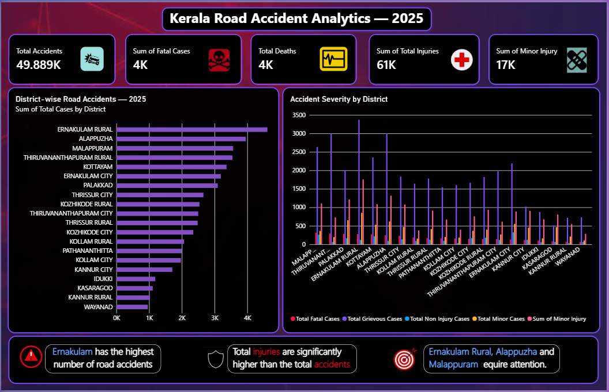

# Kerala Road Accident Analytics — 2025



## 📊 Project Overview

Kerala Road Accident Analytics — 2025 is a Power BI data analytics project focused on analyzing road accident patterns across districts in Kerala.

The dashboard provides an interactive view of accident cases, fatalities, deaths, injuries, and accident severity to identify important district-level patterns and trends.

---

## 🎯 Project Objectives

- Analyze road accident distribution across Kerala districts
- Identify districts with higher accident volumes
- Analyze fatal cases and total deaths
- Examine total and minor injuries
- Compare accident severity across districts
- Develop meaningful KPIs using DAX
- Create an interactive Power BI dashboard
- Convert raw accident data into clear analytical insights

---

## 🔎 Exploratory Data Analysis

The dataset was explored to understand the overall accident and injury patterns before developing the Power BI dashboard.

### EDA Performed

- Examined dataset structure and fields
- Checked data types and data consistency
- Reviewed missing and duplicate values
- Analyzed total accidents by district
- Compared fatal cases and total deaths
- Examined total injury distribution
- Analyzed minor injuries
- Compared accident severity across districts
- Identified districts with higher accident volumes
- Developed relevant KPIs and analytical measures

---

## 📌 Key Analysis

The dashboard includes:

- Total Accident Cases
- Fatal Cases
- Total Deaths
- Total Injuries
- Minor Injuries
- District-wise Accident Analysis
- Accident Severity by District
- Key Analytical Insights

---

## 📈 Key Findings

- Ernakulam Rural records the highest number of reported accidents in the analyzed dataset.
- Alappuzha and Malappuram also show high accident volumes.
- Total injuries are substantially higher than the number of accident events.
- Accident severity varies across districts.
- Ernakulam Rural, Alappuzha and Malappuram show high accident volumes in the analyzed data.

---

## 🛠️ Tools & Technologies

- Microsoft Power BI
- Power Query
- DAX
- Microsoft Excel
- Data Cleaning
- Data Transformation
- Exploratory Data Analysis
- Data Visualization
- Dashboard Design
- Analytical Storytelling

---

## 🔄 Project Workflow

```text
Raw Data
   ↓
Data Cleaning
   ↓
Data Transformation
   ↓
Exploratory Data Analysis
   ↓
Data Modeling
   ↓
DAX Measures
   ↓
Data Visualization
   ↓
Power BI Dashboard
   ↓
Insights
